## Stats

_Using [github-readme-stats](https://github.com/anuraghazra/github-readme-stats)_

[^username]: When `miti99` is unavailable (like GitHub :v), I often use `tiennm99`, which incorporates parts of my family name, middle name, given name, and birth year.

    Another common username is `tienthieusac` (_Tiên Thiếu Sắc_), which means _Tiên_ is _Tiến_ without the accent[^tienthieusac].

    If none of these are available, I may use other minor usernames, although I do not keep track of all of them.

[^tienthieusac]: This is inspired by [Nguyễn Tuân](https://vi.wikipedia.org/wiki/Nguy%E1%BB%85n_Tu%C3%A2n)'s pen name: _Tuấn Thừa Sắc_, which represents how _Tuân_ becomes _Tuấn_ with an optional accent.

[^badge]: Badges for Blog, PDF CV, and Web CV reference their respective platforms — Cloudflare, Adobe, and GitHub. Badge colors are referenced from [SchemeColor](https://www.schemecolor.com/).
