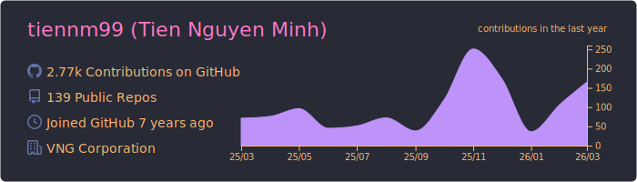
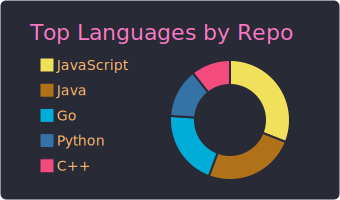
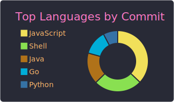
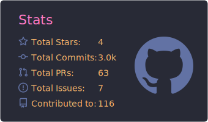
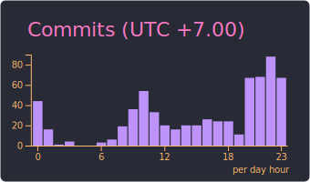

# [TienNM99](https://tiennm99.github.io)

## About me

> Just a developer wants to be magician

I am a passionate developer who believes in the magic of code. I enjoy turning complex problems into elegant solutions and bringing ideas to life through the art of programming.

My main nickname `miti99`[^1] is a creative fusion of my Vietnamese name "Nguyễn Minh Tiến" and my birth year 1999. It represents both my identity and my journey in the tech world.

## Links

[📝 Blog](https://tiennm99.github.io/)
[📄 PDF CV](https://tiennm99.github.io/cv/miti99.pdf)
[🌐 Web CV](https://tiennm99.github.io/webcv)

## Contact

[📧 Outlook](mailto:tiennm99@outlook.com)
[👥 Facebook](https://www.facebook.com/tiennm99)
[💼 Linkedin](https://www.linkedin.com/in/miti99/)

_Using [github-profile-summary-cards](https://github.com/vn7n24fzkq/github-profile-summary-cards)_

[^1]: When `miti99` is unavailable (like GitHub :v), I often use `tiennm99`, which incorporates parts of my last name, first name, middle name, and birth year.

    Another common username is `tienthieusac` (“Tiên Thiếu Sắc”), which reflects how “Tiến” becomes “Tien” when written without the accent.

    If none of these are available, I may use other minor usernames, although I do not keep track of all of them.
