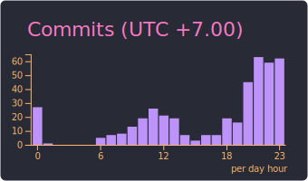

# [TienNM99](https://tiennm99.github.io)

## About me

> Just a developer who wants to be a magician

I am a passionate developer who believes in the magic of code. I enjoy turning complex problems into elegant solutions and bringing ideas to life through the art of programming.

My favorite username - `miti99`, is a creative fusion of my Vietnamese name "Nguyễn Minh Tiến" and my birth year, 1999[^username]. It represents both my identity and my journey in the tech world.

## Links

## Contact

_Using [github-profile-summary-cards](https://github.com/vn7n24fzkq/github-profile-summary-cards)_

[^username]: When `miti99` is unavailable (like GitHub :v), I often use `tiennm99`, which incorporates parts of my family name, middle name, given name, and birth year.

    Another common username is `tienthieusac` (_Tiên Thiếu Sắc_), which means _Tiên_ is _Tiến_ without the accent[^tienthieusac].

    If none of these are available, I may use other minor usernames, although I do not keep track of all of them.

[^tienthieusac]: This is inspired by [Nguyễn Tuân](https://vi.wikipedia.org/wiki/Nguy%E1%BB%85n_Tu%C3%A2n)'s pen name: _Tuấn Thừa Sắc_, which represents how _Tuân_ becomes _Tuấn_ with an optional accent.
