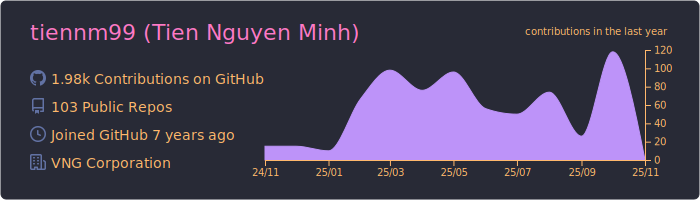
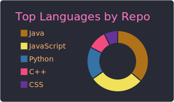

# [TienNM99](https://tiennm99.github.io)

## About me

A passionate developer who believes in the magic of code. I transform complex problems into elegant solutions, turning ideas into reality through the art of programming.

My nickname `miti99` is a creative fusion of my Vietnamese name "Nguyễn Minh Tiến" and my birth year 1999. It represents both my identity and my journey in the tech world.

## Links

  <!--
  --><!--
  -->

## Contact

  <!--
  --><!--
  -->

## Stats

  
  
  
  
  

_Using [github-profile-summary-cards](https://github.com/vn7n24fzkq/github-profile-summary-cards)_
